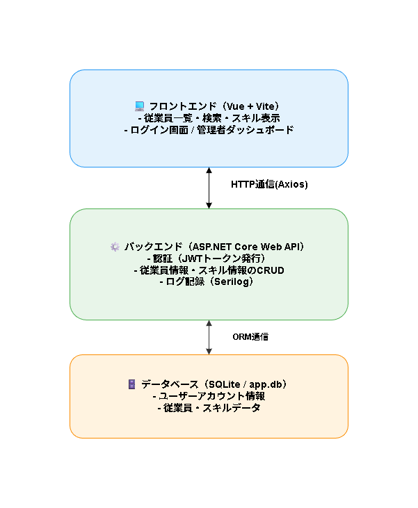

# 従業員管理システム（Employee Management System）

---

## プロジェクト概要
本プロジェクトは、**ASP.NET Core Web API（C#）** と **Vue 3（Vite構成）** を組み合わせた  
フルスタック学習・ポートフォリオ向けアプリケーションです。

管理者と一般従業員の2種類のユーザーが存在し、  
従業員情報・スキル情報を Web ブラウザ上から簡単に管理できます。

> ローカル環境で完結する設計のため、インターネット接続がなくても動作可能です。

---

## 使用技術

| 分類 | 技術 | 説明 |
|------|------|------|
| **バックエンド** | ASP.NET Core Web API | RESTful API設計、JWT認証、EF CoreによるDB操作 |
| **フロントエンド** | Vue 3 + Vite + Tailwind CSS | SPA構成による軽量でモダンなUI |
| **データベース** | SQLite + Entity Framework Core | ローカル開発に最適な軽量DB |
| **認証方式** | JWT（JSON Web Token） | ログイン後のセキュア通信を実現 |
| **ログ管理** | Serilog | システムログ出力でトラブル解析を容易に |
| **自動化** | PowerShell Script | バックエンド・フロント同時起動/終了を自動化 |

## フォルダ構成

---

## ローカル実行方法

### 🔧 必要環境
- Windows 11（推奨）
- .NET 9 SDK  
- Node.js v20.19.5  
- npm  

---

### 手順

## 3. セットアップ手順

### リポジトリをクローン
以下のコマンドを実行してプロジェクトを取得します：  
**git clone https://github.com/Yuto-Hongo/EmployeeManagementSystem.git**  
  
EmployeeManagementSystemフォルダの下記ファイルをPowerShellにて実行  
**start_project.ps1**  
  
実行がブロックされた旨のメッセージが出た場合は、  
初回起動時のみ管理者権限でPowerSellを実行し	下記コマンドを実行  
**Set-ExecutionPolicy -Scope CurrentUser RemoteSigned**  
  
起動後にPowerSell画面にて「Q」キーを押下することでプロジェクトが終了します  
  
バックエンド:エンドポイント → http://localhost:5211  
フロントエンド:エンドポイント → http://localhost:5173  
  
## 備考  
本プロジェクトは現在Seed値を用意しています  
下記アカウント情報をログイン時に使用することで権限別に本プロジェクトを使用することが可能です  
  
管理者権限  
メールアドレス: signup_admin@examle.com  
パスワード: Password123  
  
一般従業員権限  
メールアドレス: signup_general@examle.com  
パスワード: Password123
